# **邂逅react**

 https://zh-hans.reactjs.org/

## react 特点

### 声明式编程

当状态改变时，React 可以根据最新的状态去渲染我们的 UI 界面；


### 组件化

将复杂的界面拆分成一个个小的组件

### 多平台适配

react --> web 
ReactNative -->移动端跨平台 (目前 flutter 更好用)
ReactVR --> 虚拟现实 Web

## react 开发依赖

 react：包含 react 所必须的核心代码 
 react-dom：react 渲染在不同平台所需要的核心代码 
 babel：将 jsx 转换成 React 代码的工具

## 引入
1. cdn
```html
<script src="https://unpkg.com/react@18/umd/react.development.js" crossorigin></script>
<script src="https://unpkg.com/react-dom@18/umd/react-dom.development.js" crossorigin></script>
<script src=" https://unpkg.com/babel-standalone@6/babel.min.js"></script>
```
2. 下载后本地引入
3. npm

## demo 代码片段

[snippet generator (snippet-generator.app)](https://snippet-generator.app/)
```jsx
<!DOCTYPE html>
<html lang="en">
<head>
  <meta charset="UTF-8">
  <meta http-equiv="X-UA-Compatible" content="IE=edge">
  <meta name="viewport" content="width=device-width, initial-scale=1.0">
  <title>Document</title>
</head>
<body>
  <div id="root"></div>
  <script crossorigin src="https://unpkg.com/react@18/umd/react.development.js"></script>
  <script crossorigin src="https://unpkg.com/react-dom@18/umd/react-dom.development.js"></script>
  <script src="https://unpkg.com/babel-standalone@6/babel.min.js"></script>

  <script type="text/babel">
    class App extends React.Component{
      constructor(){
        super()
        this.state={
          aa:"hello world"
        }
        this.btnClick=this.btnClick.bind(this)
      }
      btnClick(){
          this.setState({
            aa:"hi react"
          })
        }
      render(){
        const { aa } = this.state
        return(
          <div>
            <h3>{aa}</h3>
          </div>
        )
      }
    }
    const root = ReactDOM.createRoot(document.querySelector("#root"))
    root.render(<App/>)
  </script>

</body>
</html>
```

## 插件快捷键 (es7 + React/Redux/React-Native)

[vscode-react-javascript-snippets/Snippets.md at 185bb91a0b692c54136663464e8225872c434637 · chillios-ts/vscode-react-javascript-snippets (github.com)](https://github.com/chillios-ts/vscode-react-javascript-snippets/blob/HEAD/docs/Snippets.md)

### rce

react class export components
```jsx 
import React, { Component } from 'react'

export class aa extends Component {
  render() {
    return (
      <div>aa</div>
    )
  }
}

export default aa
```

### rpc
 PureComponent
```jsx
import React, { PureComponent } from 'react'

export default class aa extends PureComponent {
  render() {
    return (
      <div>aa</div>
    )
  }
}
```

### 解构对象简写 dob

destructionObject
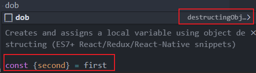

# **jsx语法**

## jsx 是什么

 JSX 是一种 JavaScript 的语法扩展extension
 使 js 中可以使用 html (html in js)
 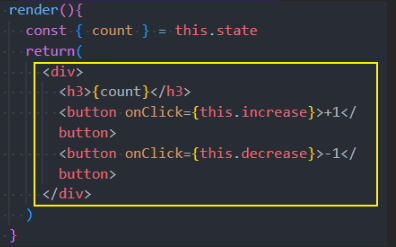

### 书写注意

- JSX 的顶层只能有一个根元素
- 我们通常在 jsx 的外层包裹一个小括号 (), 这为了方便阅读，而且可以换行书写
- jsx 中可以是单标签或双标签

### 本质

实际上，jsx 仅仅只是 React. createElement (type, config, children) 函数的语法糖。
参数

- type  eg: div /span/h3
- config eg: className
- children 标签中的内容
#### 虚拟 DOM

由 React. createElement 创建出的 js 代码 (一个对象) 就是虚拟 DOM,
react 的虚拟 DOM 可以 (打印) console. log ( ) 出来
#### 虚拟 DOM 的作用

1. diff 算法 , 决定要更新哪些东西
2. 虚拟 dom 方便跨平台渲染
3. 声明式编程

## 使用

### 注释

{ /*这是注释*/ }

### 标签内嵌入变量 (插入内容)

1. 若变量是 Number、String、Array 类型时，可以直接显示
2. 若变量是 null、undefined、Boolean 类型时，内容为空
	将 null/undefined/Boolean 转为字符串显示的方法:  toString/ +" " (字符串拼接) /String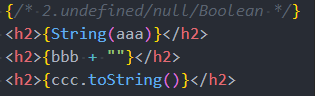
3. Object 对象类型不能作为子元素 (但是可以插入对象的具体 key) 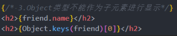
4. 插入表达式 
  - 运算表达式
  - 三元运算符
  - 执行函数
    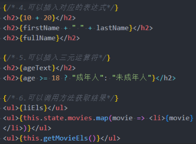

### 标签绑定属性

title/src/href/class/style 
```jsx
render() {
	const { title, imgURL, href, isActive, objStyle } = this.state

	// 需求: isActive: true -> active
	// 1.class绑定的写法一: 字符串的拼接
	const className = `abc cba ${isActive ? 'active': ''}`
	// 2.class绑定的写法二: 将所有的class放到数组中
	const classList = ["abc", "cba"]
	if (isActive) classList.push("active")
	// 3.class绑定的写法三: 第三方库classnames -> npm install classnames
	return (
		<div>
			{ /* 1.基本属性绑定 */ }
			<h2 title={title}>我是h2元素</h2>
			{/**/}
			<a href={href}>百度一下</a>
			{ /* 2.绑定class属性: 最好使用className */ }
			<h2 className={className}>哈哈哈哈</h2>
			<h2 className={classList.join(" ")}>哈哈哈哈</h2>
			{ /* 3.绑定style属性: 绑定对象类型 */ }
			<h2 style={{color: "red", fontSize: "30px"}}>呵呵呵呵</h2>
			<h2 style={objStyle}>呵呵呵呵</h2>
		</div>
	)
}

```

### this 为 undefined

构造函数内部的 this，会指向创建出来的新对象；
但是继承的类里面的函数中的 this 指向 undefined, 因为严格模式下独立调用的函数 this 指向 undefined,class 默认为严格模式
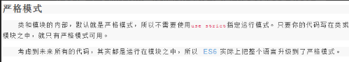
非严格模式下独立调用的函数 this 指向 window

#### 解决 this 为 undefine

1. 显示绑定 bind
2. es6 的 class fields 语法 (外部箭头函数) 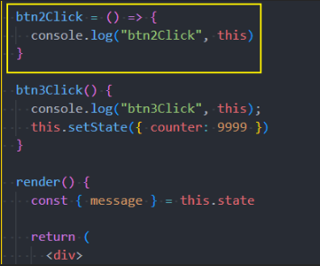
3. 箭头函数 (内部箭头函数)
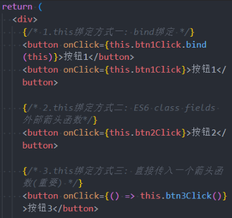

#### 参数传递

event 是默认会传递的参数
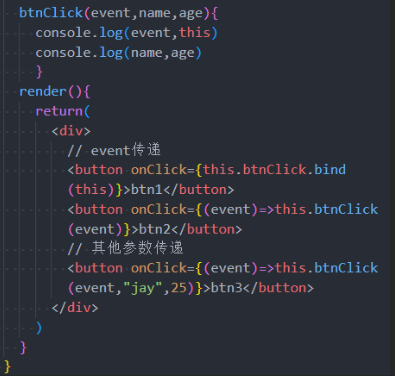

### 条件渲染

#### if

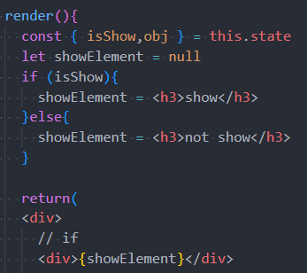

#### 三元运算符

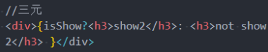
#### &&

有值才渲染, 如果是 undefined, null 则不渲染
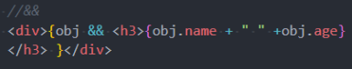

#### v-show 的效果

```jsx
<h3 style={{display:isShow? 'block':'none'}}>aaaaaaa</h3>
```


# react脚手架scaffold


## 安装

npm i create-react-app -g

检查 react 版本
create-react-app --version

创建项目
create-react-app 项目名

注意: 项目名不能包含大写字母, 且不能为中文

项目展示
cd 进入项目
npm run start / yarn start
## 目录结构

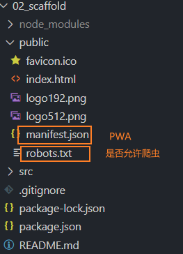

PWA
https://developer.mozilla.org/zh-CN/docs/Web/Progressive_web_apps
PWA 全称 Progressive Web App，即渐进式 WEB 应用；

- 可以将 web 内容添加至手机的主屏幕 (App manifast)
- 离线缓存功能 (service worker)
- 消息推送

## react 脚手架中的 webpack

调出 webpack 中的配置文件
eject-->弹出
npm run eject (不推荐)
craco (create-react-app config ) 是更好的配置方法

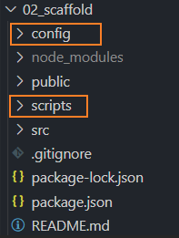

显示不同的组件
在 src--> index. js 更改需要显示的文件
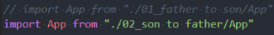


# 组件化

## 分类

- 按定义: 函数组件/类组件
- 按是否有状态维护: 无状态组件/有状态组件
- 按职责: 展示型组件/容器型组件

函数组件, 无状态组件, 展示型组件主要关注 ui 展示
类组件, 有状态组件, 容器型组件主要关注数据逻辑

### 类组件

- 组件名首字母大写 (包括函数组件)
- 类组件需要继承自 React. Component
- 类组件必须实现 render 函数
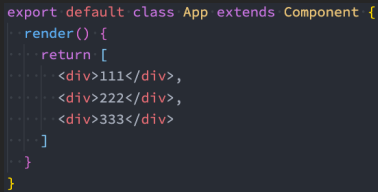
在 ES6 之前，可以通过 create-react-class 模块来定义类组件，但是目前官网建议我们使用 ES6 的 class 类定义。

#### render 函数的返回值

render 被调用时，它会检查 this.props 和 this.state 的变化并返回以下类型之一：
- React 元素,    如<div/>会被渲染为 DOM 节点 <div/>是 react 元素
- 数组或 fragments:   使得 render 方法可以返回多个元素。
- portals:   可以渲染子节点到不同的 DOM 子树中。
- 字符串或数值类型：它们在 DOM 中会被渲染为文本节点
- 布尔类型或 null：什么都不渲染。

### 函数组件

函数组件是使用 function 来进行定义的函数，只是这个函数会返回和类组件中 render 函数返回一样的内容。
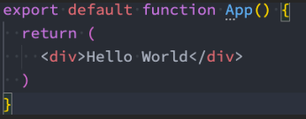
没有 hooks 的函数:

-  没有生命周期，也会被更新并挂载，但是没有生命周期函数； 
-  this 关键字不能指向组件实例（因为没有组件实例）； 
-  没有内部状态（state）；

## 生命周期

- Mount
- Update
- Unmount
没有 hooks 的函数组件没有生命周期
![[Pasted image 20221026180602.png]]
### constructor

-  通过给 this. state 赋值对象来初始化内部的 state； 
-  为事件绑定实例（this）；
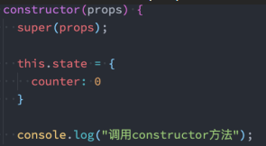
如果不初始化 state 或不进行方法绑定，则不需要为 React 组件实现构造函数。
### componentDidMount

组件挂载后（插入 DOM 树中）立即调用。

里面通常进行的操作
-  依赖于 DOM 的操作可以在这里进行； 
-  在此处发送网络请求就最好的地方；（官方建议） 
-  可以在此处添加一些订阅（会在 componentWillUnmount 取消订阅）；

### componentDidUpdate

更新后会被立即调用，首次渲染不会执行此方法。

里面通常进行的操作
-  当组件更新后，可以在此处对 DOM 进行操作； 
-  如果对更新前后的 props 进行了比较，也可以选择在此处进行网络请求；（例如，当 props 未发生变化时，则不会执行网络请求）。

### componentWillUnmount

组件卸载及销毁之前直接调用

里面通常进行的操作
-  在此方法中执行必要的清理操作；例如，清除 timer，取消网络请求或清除在 componentDidMount () 中创建的订阅等；

### 不常用生命周期

-  getDerivedStateFromProps：state 的值在任何时候都依赖于 props 时使用；该方法返回一个对象来更新 state； 
-  getSnapshotBeforeUpdate：在 React 更新 DOM 之前回调的一个函数，可以获取 DOM 更新前的一些信息（比如说滚动位置）； 
-  shouldComponentUpdate：该生命周期函数很常用，见性能优化；

## 组件间通讯  172

### 父传子:

#### 父

通过属性=值的形式来传递数据给子组件
```jsx
import React from "react"
import Son from "./Son"
import Son2 from "./Son2"

class App extends React.Component {
  constructor() {
    super()
    this.state = {
      titles: ["aa", "bb", "cc"],
      number:["11","22","33"]
    }
  }
  render() {
    const { titles,number }=this.state
    return (
      <div>
        <Son titles={titles}></Son>
        <Son2 number={number}></Son2>
      </div>
    )
  }
}
export default App
```

#### 子

通过 props 参数获取父组件传递过来的数据
```jsx
import React, { Component } from 'react'

export class Son extends Component {
  constructor(props) {
    super(props)
  }
  // 此处constructor里的操作有自动完成,可以省略
  render() {
    console.log(this.props)
    const {titles}=this.props
    return (
      <div>
        <h3>son1</h3>
        <ul>
          {titles.map(item => {
            return <li key={item}>{item}</li>
          })}
        </ul>
      </div>
    )
  }
}
export default Son
```

#### props 的类型检查 proptypes

```jsx
import React, { Component } from 'react'
import { PropTypes } from 'prop-types'

export class Son2 extends Component {
  // 2022年出的静态默认值
  // static defaultProps = {
  //   number:"21"
  // }
  render() {
    const { number }=this.props
    return (
      <div>Son2
        <ul>
          {number.map(item => {
            return <li key={item}>{item}</li>
          })}
        </ul>
      </div>
    )
  }
}
// 类型验证propTypes
Son2.propTypes = { number: PropTypes.number }
//默认值defaultProps
Son2.defaultProps={ number: 21}

export default Son2

```

#### props 的默认值 defaultProps

static defaultProps 2022
见上 (类型类型检查)

### 子传父
#### 子
通过函数和回调函数传递
监听点击, 执行函数
```jsx
import React, { Component } from 'react'

export class Add extends Component {
  add(count) {
    // const click = this.props.addClick
    // click(count)
    // count为传入的参数
    this.props.addClick(count)
  }
  render() {
    return (
      <div>
        <button onClick={e=>this.add(1)}>+1</button>
      </div>
    )
  }
}
export default Add
```
#### 父

改变数据
```jsx
import React from "react"
import Add from "./Add"
import Sub from "./Sub"

class App extends React.Component {
  constructor() {
    super()
    this.state={counter:0}
  }
  changeCount(count) {
    this.setState({counter:this.state.counter+count})
  }
  render() {
    const {counter} = this.state
    return (
      <div>
        <h3>counter:{counter}</h3>
        <Add addClick={(count)=>this.changeCount(count)}></Add>
        <Sub subClick={(count)=>this.changeCount(count)}></Sub>
      </div>
    )
  }
}
export default App
```

### slot 效果
react 不需要插槽, 可以用以下方案实现插槽功能
```jsx
import React from "react"
import Slot1 from "./Slot1"
import Slot2 from "./Slot2"
class App extends React.Component {
  render() {
    return (
      <div>App
        {/* children slot */}
        <Slot1>
          <button>AA</button>
          <h3>BB</h3>
          <a href="#">CC</a>
        </Slot1>
        {/* props slot */}
        <Slot2
          leftSlot={<button>aa</button>}
          centerSlot={<h3>bb</h3>}
          rightSlot={<i>cc</i>}
        >
        </Slot2>
      </div>
    )
  }
}
export default App
```
1. children (children 是固定的单词不能修改)
如果 children 只有一个则为元素, 多个为数组, 作为插槽使用需传入多个值
```jsx
export class Slot1 extends Component {
  render() {
    const { children } = this.props
    console.log(children)
    return (
      <div>Slot1
        <div className='slot1'>
          <div className="left">left{ children[0]}</div>
          <div className="center">center{children[1]}</div>
          <div className="right">right{children[2]}</div>
        </div>
      </div>
    )
  }
}
```
2. props 属性传递
App. jsx
```jsx
export class Slot2 extends Component {
  render() {
    const { leftSlot, centerSlot, rightSlot } = this.props
    console.log(leftSlot)
    return (
      <div>Slot2
        <div className='slot2'>
          <div className="left">left{ leftSlot}</div>
          <div className="center">center{ centerSlot}</div>
          <div className="right">right{ rightSlot}</div>
        </div>
      </div>
    )
  }
}
```

### 作用域插槽
由子组件决定插入的内容 (插入内容灵活化)
App
```jsx
import React from "react"
import Slot1 from "./Slot1"
class App extends React.Component {
  constructor() {
    super()
    this.state={title:["aa","bb","cc"]}
  }
  getItem(item) {
    if (item === "aa") {
      return <button>AA</button>
    } else if (item === "bb") {
      return   <h3>BB</h3>
    } else {
      return <a href="#">CC</a>
    }
  }
  render() {
    const {title} = this.state
    return (
      <div>App
        <Slot1 title={title}
          // itemType={item => <button>{item}</button>}
          itemType={item=>this.getItem(item)}
        >
        </Slot1>

      </div>
    )
  }
}
export default App
```

slot
```jsx
import React, { Component } from 'react'
import "./style.css"

export class Slot1 extends Component {
  render() {
    const { title ,itemType} = this.props
    console.log(itemType)
    return (
      <div className='slot1'>Slot1
        {
          title.map((item)=>{
            return (
              <div key={item} >
                {itemType(item)}
              </div>
           )
          })
        }
      </div>
    )
  }
}
export default Slot1

```

### context 上下文
用于非父子组件或全局数据共享, 不如 redux 好用
1. 创建 Context
2. Context. Provide 提供 value
3. 类组件设置 contextType=Context
4. 使用 this. context

Context. Consumer
- 用于函数组件
- 多个 Context 共享数据

### setState
如果直接修改 state 不会重新渲染, 在 setState 里面修改会使组件重新渲染到最新的数据
setState 方法是从 Component 中继承过来的
#### setState 用法

#### setState 异步
异步时 setState 内修改的数据需要 render 才能显示, 同步时不需要 render, 可以马上显示
react 18 之前的 setState 可以是异步也可以同步 (如在 setTimeout 和原生 DOM 事件中是同步的), 而之后的都是异步
异步优势
- 批量 render 提高效率和性能
- 如果同步更新了 state，但是还没有执行 render 函数，那么 state 和 props 不能保持一致

###  性能优化
#### 遍历时的 key
在 props 或 state 发生改变时需要比较更新前后的变化
- 在最后位置插入数据时, 有无 key 意义并不大
- 在前面插入数据时, 如果没有 key, 所有数据都需要修改
key 的作用: React 使用 key 来匹配原有树上的子元素以及最新树上的子元素

注意:
1. key 唯一
2. key 不要使用随机数
3. 使用 index 作为 key，对性能是没有优化的, 只是消除了警告

#### SCU
shouldComponentUpdate 生命周期
nextProps：修改后最新的 props 属性
nextState 修改后最新的 state 属性
返回值为 true 时调用 render 
如果没有 scu 优化, 那么每次调用 setState 都会 render 一次, 降低性能
```jsx 
  shouldComponentUpdate(nextProps, newState) {
    if (this.state.message !== newState.message || this.state.counter !== newState.counter) {
      return true
    }
    return false
  }
```
实现有修改时再 render

##### PureComponent
实现有修改时再 render, 不需要每次重复上述的 scu 代码
rpc
```jsx
import React, { PureComponent } from 'react'

export default class aa extends PureComponent {
  render() {
    return (
      <div>aa</div>
    )
  }
}
``` 
##### memo
针对类组件可以使用PureComponent，而函数式组件是用memo

#### 不可变数据的力量
我们希望一个原始的对象数据是不变的, 如果要修改他可以通过浅拷贝修改拷贝后的内容
```jsx
  addNewBook() {
    const newBook = { name: "Angular高级设计", price: 88, count: 1 }

    // 1.直接修改原有的state, 重新设置一遍
    // 在PureComponent是不能引入重新渲染(re-render)
    this.state.books.push(newBook)
    this.setState({ books: this.state.books })

    // 2.赋值一份books, 在新的books中修改, 设置新的books
    const books = [...this.state.books]
    books.push(newBook)
    this.setState({ books: books })
  }
```
第一种方法直接修改原有的数据在 pureComponent 不会 render, 因为 react 是通过先对比对象的地址是否相同, 不同才更新, 即使对象内数组有变化, 但对象的地址是一样的因此不会 render
### 获取原生 DOM (ref)
通常情况下不需要、也不建议直接操作 DOM 原生，但是某些特殊的情况，确实需要获取到 DOM, 如
- 管理焦点，文本选择或媒体播放
- 触发强制动画
- 集成第三方 DOM 库
#### 获取元素
  1. 方式一: 在 React 元素上绑定一个 ref 字符串 (不推荐) ` console.log(this.refs.why)`
  2. 方式二: 提前创建好 ref 对象, createRef (), 将创出来的对象绑定到元素 `console.log(this.titleRef.current)`
  3. 方式三: 传入一个回调函数, 在对应的元素被渲染之后, 回调函数被执行, 并且将元素传入 `console.log (this.titleEl)`
```jsx
import React, { PureComponent, createRef } from 'react'

export class App extends PureComponent {
  constructor() {
    super()
    this.titleRef = createRef()
    this.titleEl = null
  }

  getNativeDOM() {
    // 1.方式一: 在React元素上绑定一个ref字符串(不推荐)
    console.log(this.refs.why)
    // 2.方式二: 提前创建好ref对象, createRef(), 将创建出来的对象绑定到元素
    console.log(this.titleRef.current)
    // 3.方式三: 传入一个回调函数, 在对应的元素被渲染之后, 回调函数被执行, 并且将元素传入
    console.log(this.titleEl)
  }

  render() {
    return (
      <div>
        <h2 ref="why">Hello World</h2>
        <h2 ref={this.titleRef}>你好啊,李银河</h2>
        <h2 ref={el => { this.titleEl = el }}>你好啊, j</h2>
        <button onClick={e => this.getNativeDOM()}>获取DOM</button>
      </div>
    )
  }
}

export default App
```
#### 获取组件
##### 获取类组件 createRef ()
```jsx
import React, { PureComponent, createRef } from 'react'


class HelloWorld extends PureComponent {
  test() {
    console.log("test------")
  }

  render() {
    return <h1>Hello World</h1>
  }
}

export class App extends PureComponent {
  constructor() {
    super()

    this.classRef = createRef()
  }
  getComponent() {
    console.log(this.classRef.current)
    this.classRef.current.test()
  }
  render() {
    return (
      <div>
        <HelloWorld ref={this.classRef}/>
        <button onClick={e => this.getComponent()}>获取组件实例</button>
      </div>
    )
  }
}

export default App
```

##### 获取函数组件forwardRef()
```jsx
import React, { PureComponent, createRef, forwardRef } from 'react'


const HelloWorld = forwardRef(function(props, ref) {
  return (
    <div>
      <h1 ref={ref}>Hello World</h1>
      <p>哈哈哈</p>
    </div>
  )
})

export class App extends PureComponent {
  constructor() {
    super()

    this.fooRef = createRef()
  }

  getComponent() {
    console.log(this.fooRef.current)
  }

  render() {
    return (
      <div>
        <HelloWorld ref={this.fooRef}/>
        <button onClick={e => this.getComponent()}>获取组件实例</button>
      </div>
    )
  }
}

export default App
```

### 受控组件
表单默认情况是由浏览器来维护处理数据, 缺点是提交数据有页面刷新, 因此希望把数据交由 react 来处理
由 react 处理数据的表单就是受控组件, 反之由浏览器处理数据的就是非受控组件, 推荐使用受控组件

非受控组件:
```jsx
<input type="text" />
```
受控组件: 
```jsx
 <input type="text" value={username} onChange={e => this.inputChange(e)}/>
```

```jsx
import React, { PureComponent } from 'react'

export class App extends PureComponent {
  constructor() {
    super()

    this.state = {
      username: "j"
    }
  }

  inputChange(event) {
    console.log("inputChange:", event.target.value)
    this.setState({ username: event.target.value })
  }

  render() {
    const { username } = this.state

    return (
      <div>
        受控组件:
        <input type="text" value={username} onChange={e => this.inputChange(e)}/>
        <br />
        非受控组件:
        <input type="text" />
        <h2>username: {username}</h2>

      </div>
    )
  }
}

export default App
```

- checkbox , radio (单选)---> checked,
- text , textarea , select ---> value


### 非受控组件
由浏览器处理数据原始表单
用 ref 来获取表单 DOM 节点中的数据

默认值:
- checkbox , radio (单选)--> defaultChecked
-  text , textarea , select--->  defaultValue
```jsx
import React, { createRef, PureComponent } from 'react'

export class App extends PureComponent {

  constructor() {
    super()

    this.state = {
      intro: "哈哈哈"
    }

    this.introRef = createRef()
  }

  componentDidMount() {
    // 数据监听(不推荐)
    // this.introRef.current.addEventListener
  }
  handleSubmitClick(event) {
    // 1.阻止默认的行为
    event.preventDefault()
    console.log("获取结果:", this.introRef.current.value)

  }

  render() {
    const { intro } = this.state

    return (
      <div>
        <form onSubmit={e => this.handleSubmitClick(e)}>
          <input type="text" defaultValue={intro} ref={this.introRef} />

          <div>
            <button type='submit'>注册</button>
          </div>
        </form>
      </div>
    )
  }
}

export default App
```

### 高阶组件
高阶函数满足一下条件之一:
- 输入为函数
- 输出为函数
高阶组件本身不是一个组件，而是一个函数
高阶组件的参数是组件，返回值也是组件
高阶组件举例
```jsx
function foo(component) {
  // 1.定义类组件
  class newComponent1 extends PureComponent{
    render() {
      return <component name="name1" />
      // 高阶组件对组件进行了拦截,给他名字可以方便操作
    }
  }
  return newComponent1

  // 2.定义函数组件
    // function newComponent2(props) {

  // }
  // return newComponent2
}
```
调用
```jsx
const helloWorldFoo = foo(helloWorld)
```