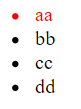
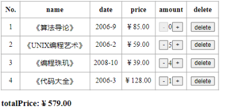
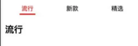

# 案例demo

## jsx

### 动态样式



```jsx
  <script type="text/babel">
    class App extends React.Component{
      constructor(){
        super()
        this.state={
          arr:["aa","bb","cc","dd"],
          currentIndex:0
        }
      }
      itemClick(index){
          this.setState({currentIndex:index })
        }
      render(){
        const { arr,currentIndex } = this.state
        return(
          <div>
            <ul>
              {arr.map((item,index)=>{
                return(
                  <li className={currentIndex===index?'active':''} key={item} onClick={()=>this.itemClick(index)}>{item}</li>
                )
              })}
            </ul>
          </div>
        )
      }
    }
    const root = ReactDOM.createRoot(document.querySelector("#root"))
    root.render(<App/>)
  </script>
```

### 购书



## 组件间通讯

### 1. 计数器


06-03-02(vsc)

### 2. tab 切换


00-07-01


